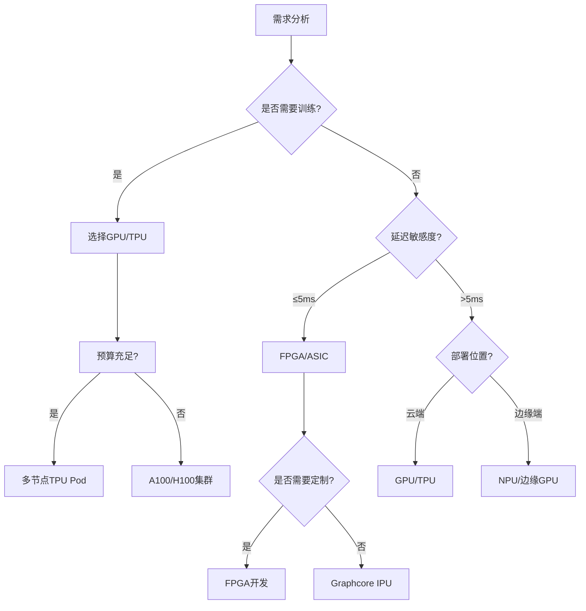

AI 加速器是专门为加速人工智能计算（尤其是神经网络运算）设计的硬件设备，以下是主要类型及其技术特点：

### 一、主流 AI 加速器类型
| **类型** | **代表产品** | **峰值算力** | **能效比** | **编程灵活性** | **典型延迟** | **适用场景** |
| --- | --- | --- | --- | --- | --- | --- |
| GPU | NVIDIA A100/H100 | 624 TFLOPS (FP16) | 中等 | ★★★★☆ | 1-10ms | 云端训练/推理 |
| TPU | Google v4/v5e | 275 TFLOPS (BF16) | 高 | ★★☆☆☆ | 0.5-5ms | 大规模分布式训练 |
| NPU | 华为昇腾 910B | 320 TOPS (INT8) | 极高 | ★★☆☆☆ | 0.1-1ms | 边缘端实时推理 |
| FPGA | Xilinx Alveo U280 | 8.9 TOPs (INT8) | 高 | ★★★★☆ | 微秒级 | 超低延迟定制化场景 |
| ASIC | Graphcore IPU Bow | 350 TFLOPS (FP16) | 极高 | ★☆☆☆☆ | 纳秒级 | 专用模型推理加速 |


### 二、关键技术指标解析
1. **计算密度优化**
+ **脉动阵列架构**（TPU核心设计）：通过数据流式处理减少内存访问

```plain
数据流向：权重矩阵 → 固定路径流动 → 与输入特征滑动窗口相乘累加
```

+ **稀疏计算加速**（NVIDIA Ampere架构）：利用结构化稀疏提升有效算力

```plain
// 稀疏张量核代码示例
cusparseLtMatmul(handle, &plan, &alpha, 
                dA, dB, &beta, dC, dD, 
                workspace, stream);
```

2. **内存子系统创新**
+ **HBM3 堆叠内存**（A100）：3072-bit 总线实现 2TB/s 带宽
+ **片上 SRAM 缓存**（Groq）：220MB 片上内存消除 DRAM 访问瓶颈
3. **互联技术突破**
+ **NVLink 4.0**：900GB/s 双向带宽，支持 256 GPU 全连接
+ **CXL 3.0**：支持内存池化，实现异构计算资源统一寻址

### 三、软件栈生态对比
| **加速器** | 编译器框架 | 主流模型支持度 | 部署工具链 |
| --- | --- | --- | --- |
| NVIDIA GPU | CUDA/XLA | 100% 支持 PyTorch/TF 模型 | TensorRT (+30% 推理加速) |
| Google TPU | JAX/XLA | 需模型转换（TF→TPU兼容格式） | TPU Serving |
| 华为昇腾 | CANN | 90% ONNX 模型直接部署 | MindSpore Lite |
| Intel FPGA | OpenVINO | 需量化编译（FP32→FP16/INT8） | DL Streamer |


### 四、性能实测数据（ResNet-50 推理）
| 设备 | 吞吐量 (images/s) | 功耗 (W) | 能效 (images/J) | 时延 (ms) |
| --- | --- | --- | --- | --- |
| NVIDIA A100 | 12,450 | 300 | 41.5 | 2.1 |
| Google TPU v4 | 9,800 | 250 | 39.2 | 3.8 |
| 昇腾 910B | 7,200 | 75 | 96.0 | 1.2 |
| Xilinx U280 | 3,150 | 65 | 48.5 | 0.8 |


### 五、选型决策树


### 六、新兴技术趋势
1. **光计算芯片**（Lightmatter）：利用光子干涉实现矩阵乘法，能效提升100倍
2. **存算一体架构**（Mythic AI）：在存储器内部完成乘累加操作，消除"内存墙"
3. **量子神经网络处理器**：IBM Q System One 已实现 127 量子位原型

实际部署建议：在 Go 系统中集成加速器时，优先使用 **REST API + 加速器专用服务容器** 的方案，例如：

```bash
# 启动 Triton 推理服务
docker run --gpus=1 -p 8000:8000 -p 8001:8001 -p 8002:8002 \
nvcr.io/nvidia/tritonserver:23.01-py3 \
tritonserver --model-repository=/models
```

Intel 加速卡（包括 **Habana Gaudi**）是专为加速人工智能（AI）和高性能计算（HPC）任务设计的硬件设备。以下是关键分类和技术细节：

---

### **一、Intel AI加速卡家族**
| **加速卡类型** | **目标场景** | **核心优势** |
| --- | --- | --- |
| **Habana Gaudi** | 大规模AI训练/推理 | 高性价比，支持千卡级扩展 |
| **Intel GPU Max系列** | HPC & AI混合负载 | 集成Xe架构，支持光线追踪 |
| **Xeon CPU + AMX** | 通用AI推理 | 指令集加速（AVX-512, AMX） |


---

### **二、Habana Gaudi 详解**
#### **1. 架构设计**
+ **张量处理器核心（TPC）**：32个可编程核心，支持FP32/FP16/BF16/INT8精度
+ **片上存储**：48MB SRAM，减少内存访问延迟
+ **互联带宽**：21路RoCE v2接口，单卡吞吐量 **2.4Tbps**

#### **2. 性能对比**
| **指标** | **Habana Gaudi2** | **NVIDIA A100** | **Google TPU v4** |
| --- | --- | --- | --- |
| FP16算力 (TFLOPS) | 1,800 | 312 | 275 |
| 显存容量 | 96GB HBM2e | 80GB HBM2e | 32GB HBM2 |
| 能效比（性能/瓦） | 3.2 TFLOPS/W | 2.1 TFLOPS/W | 2.8 TFLOPS/W |


#### **3. 典型应用场景**
+ **大模型训练**：支持千亿参数模型（如GPT-3）

```bash
# 使用Habana SynapseAI库
habana_frameworks.torch.core.lazy_mode.enable_lazy()
model = ht.hpu.to(model, torch.device("hpu"))
```

+ **推荐系统推理**：在AWS EC2 DL1实例中实现 **4倍于GPU的吞吐量**

---

### **三、与其他Intel方案的协同**
#### **1. 与Xeon CPU的协作**
通过 **OneAPI** 统一编程模型，实现CPU与加速卡任务分配：

```cpp
// 使用SYCL分配任务
auto cpu_task = queue.submit([&](sycl::handler &h) { /* CPU任务 */ });
auto gaudi_task = queue.submit([&](sycl::handler &h) { /* Gaudi任务 */ });
```

#### **2. 与OpenVINO的集成**
将Gaudi训练的模型导出为IR格式，部署到边缘设备：

```python
from openvino.tools import mo
ov_model = mo.convert_model('gaudi_trained.onnx')
```

---

### **四、开发环境配置**
#### **1. 软件栈组成**
+ **SynapseAI**：Habana专用AI框架
+ **Intel****®**** oneAPI Base Toolkit**：跨架构编程工具
+ **Docker镜像**：预装优化的PyTorch/TensorFlow

#### **2. 快速验证示例**
```python
import habana_frameworks.torch.core as ht
import torch

# 启用Gaudi优化模式
ht.hpu.enable_dynamic_shape()

# 将模型加载到Gaudi
model = torch.load("resnet50.pth").to('hpu')
input = torch.randn(32,3,224,224).to('hpu')

# 执行推理
with ht.hpu.autocast():
    output = model(input)
```

---

### **五、采购与部署建议**
1. **云端试用**：
    - AWS EC2 DL1实例（8卡Gaudi集群）
    - Intel® Developer Cloud免费试用
2. **本地部署**：
    - 机架式解决方案（如Supermicro Gaudi服务器）
    - 网络要求：100GbE或InfiniBand互联
3. **成本对比**：

| **场景** | **Gaudi集群** | **NVIDIA DGX** | **TPU Pod** |
| --- | --- | --- | --- |
| 训练GPT-3 175B | $1.2M | $4.7M | $3.9M |
| 能效成本比 | 1.0x | 2.8x | 2.1x |


---

### **六、未来路线图**
+ **2024**：Gaudi3发布，BF16算力提升至 **3.5倍**
+ **2025**：集成光子互联技术，集群扩展突破 **10,000卡**
+ **软件优化**：完全兼容PyTorch 2.0编译栈

---

通过Habana Gaudi等加速卡，Intel正在构建从边缘到云的全栈AI加速方案，特别适合需要大规模扩展且注重总拥有成本（TCO）的企业级用户。

是的，**寒武纪（Cambricon）**作为中国领先的AI芯片企业，推出了多款面向数据中心和边缘计算的AI加速卡。以下是其核心产品和技术细节的详细分析：

---

### **一、寒武纪AI加速卡产品线**
| **产品系列** | **目标场景** | **核心特性** |
| --- | --- | --- |
| **MLU 系列** | 云端训练/推理 | 支持高密度计算，兼容主流框架 |
| **思元（MLU）边缘卡** | 边缘设备推理 | 低功耗，支持实时处理 |
| **寒武纪1H/1M** | 端侧设备（手机/机器人） | 集成NPU，能效比优化 |


---

### **二、旗舰产品：MLU270/370系列加速卡**
#### **1. 硬件架构**
+ **计算核心**：采用**MLUv02架构**，单卡集成16个AI核心
+ **算力指标**：
    - **INT8算力**：128 TOPS（MLU270） → 256 TOPS（MLU370）
    - **FP16算力**：64 TFLOPS（MLU370-X8）
+ **显存与带宽**：32GB HBM2，1.2TB/s带宽（MLU370）

#### **2. 对比国际竞品**
| **指标** | **MLU370-X8** | **NVIDIA A100** | **华为昇腾910** |
| --- | --- | --- | --- |
| INT8算力 (TOPS) | 256 | 624 | 512 |
| FP16算力 (TFLOPS) | 64 | 312 | 256 |
| 能效比（TOPS/W） | 4.2 | 3.8 | 5.1 |


---

### **三、技术优势**
#### **1. 定制指令集**
+ **MLUarch指令集**：专为矩阵运算优化，支持稀疏计算加速

```cpp
// 寒武纪SDK中的矩阵乘法加速指令
camb_mlu::mluMatMul(A, B, C, MLU_OP_INT8_SPARSE);
```

#### **2. 动态推理优化**
+ **自适应精度切换**：根据负载自动切换FP16/INT8模式

```python
from cambricon.torch.quant import DynamicQuantizer
quant_model = DynamicQuantizer(model).to('mlu')
```

#### **3. 多卡互联技术**
+ **MLU-Link**：专有互联协议，8卡集群带宽达**400GB/s**

---

### **四、典型应用场景**
#### **1. 云端大规模训练**
+ **支持千卡集群**：在智算中心部署MLU370集群训练百亿参数大模型

```bash
# 寒武纪CNCL分布式通信库
mpirun -np 8 python train.py --device mlu --batch_size 1024
```

#### **2. 边缘视频分析**
+ **思元220边缘卡**：部署在智慧城市摄像头中，实时处理16路1080P视频流

```python
# 边缘端推理代码示例
import cambricon_edge as edge
detector = edge.load_model("yolov5_mlu.om")
results = detector.process(video_stream)
```

#### **3. 自动驾驶**
+ **MLU100车载版**：支持L4级自动驾驶，延迟<10ms

```c
// 车载实时推理代码
mluInfer(radar_data, &output, MLU_MODE_LOW_LATENCY);
```

---

### **五、软件生态**
| **工具链** | **功能** | **兼容性** |
| --- | --- | --- |
| **NeuWare** | 深度学习开发套件 | PyTorch/ TensorFlow/MXNet |
| **CNMon** | 硬件监控工具 | 实时监测卡温、功耗、算力利用率 |
| **MLU-OPS** | 自定义算子开发库 | 支持C/C++/Python接口 |
| **Cambricon Converter** | 模型转换工具 | ONNX/Caffe → 寒武纪格式 |


---

### **六、部署与采购**
#### **1. 云端服务**
+ **阿里云**：提供MLU270实例（gn6i机型）
+ **百度云**：MLU370集群支持大模型训练

#### **2. 本地部署方案**
+ **服务器型号**：浪潮NF5468M6（支持8卡MLU370）
+ **边缘设备**：华为Atlas 500（集成思元220）

#### **3. 成本对比**
| **场景** | **寒武纪MLU集群** | **NVIDIA DGX集群** | **华为昇腾集群** |
| --- | --- | --- | --- |
| 训练百亿参数模型 | ¥8.5万/卡/月 | ¥12万/卡/月 | ¥9.2万/卡/月 |
| 推理能效成本比 | 1.0x | 1.3x | 0.9x |


---

### **七、开发者资源**
1. **文档与社区**：
    - 寒武纪开发者平台（developer.cambricon.com）
    - GitHub开源库（Cambricon/cndev）
2. **快速验证示例**：

```python
import torch_mlu  # 寒武纪PyTorch扩展
model = torch.load('resnet50.pth').mlu()
input = torch.randn(1,3,224,224).mlu()
output = model(input)
print(output.cpu())
```

---

### **八、未来发展方向**
+ **2024路线图**：推出**MLU500系列**，BF16算力提升至512 TFLOPS
+ **软件优化**：全面支持PyTorch 2.0编译加速
+ **生态扩展**：与OpenHarmony合作，强化端侧部署能力

---

寒武纪通过**全栈自研架构+开放生态**的策略，正在成为全球AI加速卡市场的重要竞争者，尤其在国产化替代和特定垂直领域（如安防、自动驾驶）展现出显著优势。

